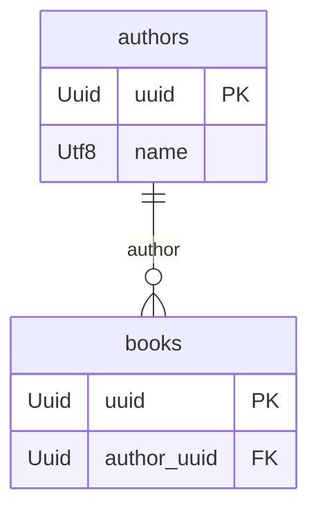

# Migrations

Migrations are a way to manage the database schema in production. Like in TypeORM, a migration is a class with `up`/`down` methods receiving a `YdbExecutor`.

## Migration structure

```ts
import type { YdbMigration, YdbExecutor } from '@ycforge/ydb-orm';
import { executeSql } from '@ycforge/ydb-orm';

export class CreateUsers1755000000000 implements YdbMigration {
  readonly name = '1755000000000-CreateUsers';

  async up(executor: YdbExecutor): Promise<void> {
    await executeSql(executor, 'CREATE TABLE `users` (`uuid` Uuid, PRIMARY KEY (`uuid`))');
  }

  async down(executor: YdbExecutor): Promise<void> {
    await executeSql(executor, 'DROP TABLE `users`');
  }
}
```

Applied migrations are tracked in the `ydb_migrations` table (created automatically). Execution order is by file name (`<timestamp>-<Name>.ts`).



Node ≥ 22.18 imports `.ts` directly; no separate ts-node is needed. Because of native type stripping, import types (`YdbMigration`, `YdbExecutor`) via `import type` — a regular named type import fails at runtime.



## CLI

The package installs the `yorm` binary:

```bash
yorm migration:create CreateUsers      # empty migration ./migrations/<ts>-CreateUsers.ts
yorm migration:generate AddPhotos      # migration by entity↔DB diff
yorm migration:run                     # apply all new migrations
yorm migration:revert                  # revert the last one
yorm migration:show                    # migration status (alias — migration:status)
yorm migration:check                   # CI readiness check (non-zero exit when not ready)
yorm schema:verify                     # verify DB schema against entity metadata
yorm entity:create UserProfile         # entity ./src/user-profile.entity.ts
yorm metadata:dump                     # entity metadata as JSON (stdout, no DB)
yorm entity:diagram                    # Mermaid ER diagram from metadata (stdout/--output, no DB)
yorm completion bash                   # shell completion script (bash|zsh|fish)
```

Options:

- `--dir <path>` — migrations directory (default `./migrations`; for `entity:create` — `./src`).
- `--config <path>` — path to config.
- `--output <file>` — output file for `entity:diagram` (existing files are never overwritten).
- `--json` — machine-readable output for `migration:show`, `migration:status` and `migration:check`.

### Interactive entity:create

In a TTY, `yorm entity:create <name>` starts an interactive entity wizard:

1. table name (defaults to snake_case of the entity name, validated);
2. columns in a loop "name → YDB type → PK → encrypted/blind index → enum (values + Utf8/Int32 storage)";
3. for date-like columns (`Date`/`Datetime`/`Timestamp`) — auto creation/update timestamps (`@YdbCreateDateColumn`/`@YdbUpdateDateColumn`);
4. optional TTL (`@YdbTtl`, ISO 8601 duration, e.g. `PT2H`) on a chosen date-like column;
5. preview of the generated file and a write confirmation.

Guarantees:

- every entered definition is validated **before** any file is written: table and property names (identifiers `[A-Za-z_][A-Za-z0-9_]*`, no collisions with `YdbBaseEntity` members), presence of a PK, uniqueness of columns and enum values, date column types, TTL interval;
- an existing file is never overwritten: the collision is detected before the first question and fails the command;
- cancellation (Ctrl+C) and EOF (Ctrl+D) exit cleanly (exit code 130) without writing anything;
- no database access and no DDL — purely local file generation;
- outside a TTY (CI, scripts, closed stdin) input is never read: the default template (`uuid` PK of type `Uuid` + a `name` column) is generated deterministically and the command does not hang.

Example of a generated entity:

```ts
import {
  YdbBaseEntity,
  YdbColumn,
  YdbCreateDateColumn,
  YdbEntity,
  YdbEnum,
  YdbPrimaryColumn,
  YdbTtl,
} from '@ycforge/ydb-orm';

export enum StatusEnum {
  ACTIVE = 'active',
  NEW_ORDER = 'new_order',
}

@YdbEntity('orders')
@YdbTtl({ interval: 'PT30D', column: 'expires_at' })
export class Order extends YdbBaseEntity {
  @YdbPrimaryColumn('Uuid')
  uuid: string;

  @YdbColumn('Utf8')
  @YdbEnum({ values: Object.values(StatusEnum), storage: 'Utf8' })
  status: StatusEnum;

  @YdbCreateDateColumn()
  @YdbColumn('Timestamp')
  created_at: Date;

  @YdbColumn('Timestamp')
  expires_at: Date;
}
```

For scripts and tooling the generation is also available programmatically:

```ts
import { createEntityFileFromSpec } from '@ycforge/ydb-orm';

const created = createEntityFileFromSpec('./src', {
  className: 'OrderEntity',
  tableName: 'orders',
  columns: [
    { name: 'uuid', type: 'Uuid', primary: true },
    { name: 'status', type: 'Utf8', enumValues: ['active'], enumStorage: 'Utf8' },
    { name: 'created_at', type: 'Timestamp', createDate: true },
  ],
});
```

Also exported: `validateEntitySpec`, `renderEntityFile`, `buildDefaultEntitySpec`; the interactive wizard can run over arbitrary streams via `runEntityCreateCommand` / `runEntityCreateWizard`.

### Readiness check

`migration:check`, `migration:status` and `migration:show` are **read-only**: they only inspect the current state (`DescribeTable` for `ydb_migrations` + a bare `SELECT` of its records; `DescribeTable` for entities) and never change anything — in particular, the bookkeeping table is neither created nor altered (no `CREATE TABLE`/`ALTER TABLE`). States and exit codes:

| State | Exit code | Meaning |
| --- | --- | --- |
| ready | 0 | all migrations applied; schema matches if it was checked |
| pending | 1 | there are unapplied migrations |
| interrupted | 2 | there are interrupted migrations (`state='started'`): a previous run stopped mid-way, the database may be partially migrated |
| schema-drift | 3 | the database schema differs from entity metadata (checked only when the `entities` array is set in the config) |
| modified | 4 | content of an applied migration changed after it was applied |
| command error | 5 | failed to connect, read state, or an unexpected failure |

If the `ydb_migrations` bookkeeping table does not exist yet (a fresh database), it is not created: nothing is considered applied — with migration files present that is pending (exit 1), without them it is ready (exit 0). In `--json` this state is distinguished by the `bookkeeping: {exists: false}` field; legacy tables without the `hash`/`state` columns are read as-is, without ALTER.

Interrupted and modified migrations are explicitly not treated as successfully applied; orphan records (the file was deleted after applying) are shown in the report but do not break readiness on their own. When several states are detected at once, the exit code follows the priority: `interrupted` → `modified` → `pending` → `schema-drift`. Resolve an interrupted migration with `migration:repair`.

Text mode: summary or migration list goes to stdout, problems and the schema diff go to stderr; the final line starts with `Up to date:` or `Not ready:`. Diff colors follow the real output stream and are disabled outside a TTY and by `NO_COLOR`. For CI parsing use `--json`: the whole report is printed to stdout with a stable schema — `ready`, `state`, `states`, `exitCode`, the `pending`/`interrupted`/`modified`/`orphaned` lists, the `migrations` array with per-migration flags, and the `schema` block with found discrepancies.

`migration:generate` and `schema:verify` print a colored diff of "entities vs database" discrepancies, grouped by table. Colors are disabled when output is not a TTY or via the `NO_COLOR` environment variable.

### Metadata export: metadata:dump

The read-only command dumps metadata of the entities from the config (`entities`, same as for `migration:generate`) as deterministic JSON — **without connecting to the database**: no driver, no executor, no DDL is involved. The command is JSON-only by nature: the whole dump goes to stdout, there is no separate text mode.

```bash
yorm metadata:dump
```

The format is versioned via the top-level `format`/`version` fields; for every entity it includes:

- class and table names; columns with YDB types (including synthetic `{field}_bi` blind-index columns) and the primary key with its column order;
- relations of all types: relation type, target entity/table, join column, inverse property (`inverseProperty`), for many-to-many — a reference to the join table; physical join-table descriptions are listed separately under `joinTables` (columns and their types derived from the actual primary keys, plus the owning side);
- indexes (name, columns with their order preserved, unique) and TTL (column, ISO 8601 interval, unit);
- encryption without secrets: only declarative field flags (blind index + the `_bi` column name, lazy, aadOverride) and AAD primary-key fields; providers, keys and runtime material are never exported;
- enum metadata (values in semantic order, `Utf8`/`Int32` storage), JSON columns and eager relations.

Determinism: entities (by table name), columns, indexes, relations and JSON keys are ordered stably — repeated runs produce byte-for-byte identical output. Inheritance follows rules #92/#107: own `@YdbIndex`/`@YdbTtl` are not inherited, while columns/PK/encryption/eager are. Invalid metadata (a class without `@YdbEntity`, a duplicate table name, a missing primary key, conflicting join tables, an invalid join-column selector, an incompatible TTL) fails the command with a clear error before any output.

External tools can use the programmatic API: `buildMetadataDump(entities)` and the `MetadataDump`, `DumpedEntity` and related types are exported from the package.

### Mermaid ER diagram: entity:diagram

The read-only command renders the same canonical metadata (the same source as `metadata:dump` — `buildMetadataDump`) into a Mermaid ER diagram — **without connecting to the database**: no driver, no executor, no DDL. Valid metadata is required: any configuration error fails the command before the first byte of output.

```bash
yorm entity:diagram                            # Mermaid text to stdout
yorm entity:diagram --output docs/schema.mmd   # to a file (overwriting is forbidden)
```

What the diagram shows:

- every entity from the config `entities` as a block with columns and YDB types; primary-key columns come first **in declaration order** (composite PK order is significant, #89) marked with `PK`;
- one-to-many / many-to-one pairs over the same join column produce a single `||--o{` line; a unidirectional one-to-many is drawn from the parent side; one-to-one is drawn as `||--o|`; FK columns are marked with `FK`;
- many-to-many — via the physical join table (#90/#139): a separate block with both columns (`PK, FK`) and two lines "owner → join → inverse side";
- determinism: block/line ordering is stable and independent of the input list order — repeated runs produce byte-for-byte identical output;
- safe names: table names and relation labels are always quoted; column names invalid for Mermaid attributes are sanitized, with the original preserved in a comment.

Example output:



External tools can use the programmatic API: `buildEntityDiagram(entities)` and `writeDiagramFile(path, diagram)` are exported from the package.

## Shell completion

```bash
# bash
yorm completion bash | sudo tee /etc/bash_completion.d/yorm
# zsh
yorm completion zsh > ~/.zsh/completions/_yorm
# fish
yorm completion fish > ~/.config/fish/completions/yorm.fish
```

## CLI config

File `./yorm.config.ts` (or `.mts`/`.mjs`/`.js`; also searched in `./src/`). The legacy name `./ydb-orm.config.*` is still supported — when both exist, `yorm.config.*` wins:

```ts
import { UserEntity } from './src/user.entity.js';

export default {
  endpoint: process.env.YDB_ENDPOINT!,
  auth_type: 'auth_key',
  authOptions: { authorized_key_path: './authorized_key.json' },
  entities: [UserEntity],        // required for migration:generate
  migrationsDir: './migrations', // optional
};
```

Without a config, the CLI reads env: `YDB_ENDPOINT` (or `YDB_CONNECTION_STRING`), `YDB_AUTH_TYPE` (default `anonymous`), `YDB_AUTHORIZED_KEY_PATH`.

## migration:generate

The command builds a diff across all `entities` from the config:

- no table → `CREATE TABLE` (+ `DROP TABLE` in `down`);
- no columns → `ADD COLUMN` (+ `DROP COLUMN` in `down`);
- type/PK mismatches and extra columns are not changed automatically — they appear in the migration as `WARNING` comments.

### Rename hints

When a diff looks like a column rename — exactly one extra DB column and exactly one new entity column with the same type, with no PK, index, TTL or blind-index (`_bi`) involvement — the command does not silently emit `ADD COLUMN` + `DROP COLUMN`. Instead, ADD/DROP are suppressed for that pair and a comment hint is added to `up()`/`down()`:

```ts
// SUGGESTION (not applied automatically): possible column rename detected.
// YQL has no ALTER TABLE RENAME COLUMN yet — verify the data and migrate manually:
//   ALTER TABLE `photos` RENAME COLUMN `label` TO `title`;
```

The hint is never executed automatically: YQL does not support `RENAME COLUMN` yet (only tables can be renamed in YDB), so applying it is always a manual decision after verifying the data. If the situation is ambiguous (multiple candidates, key/indexed/TTL columns, encryption metadata), the behavior stays as before: `ADD COLUMN` + `WARNING`. The same hint appears in the colored diff of `schema:verify`.

```bash
yorm migration:generate AddPhotos
```

## Programmatic API

You can embed migrations into your own pipeline:

```ts
import {
  YdbMigrationRunner,
  loadMigrationsFromDir,
  planMigration,
  executeSql,
} from '@ycforge/ydb-orm';

const migrations = await loadMigrationsFromDir('./migrations');
const runner = new YdbMigrationRunner(executor);

await runner.run();       // apply new
await runner.revert();    // revert the last one
const status = await runner.status(); // status
```

`planMigration(expected, existing)` is a pure function that builds a migration plan from the diff between expected entity schemas and the current database state.